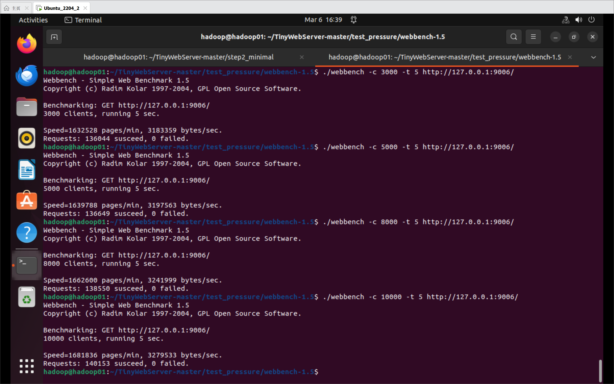

WebServerV2
===========
使用epoll循环处理，listenfd和connfd均使用LT，单线程io，有简单的http连接

--------------------------
使用webbench压测

* >并发量3000，时间5s-----27208.8 QPS
* >并发量5000，时间5s-----27329.8 QPS
* >并发量8000，时间5s-----27710.0 QPS
* >并发量10000，时间5s-----28030.6 QPS