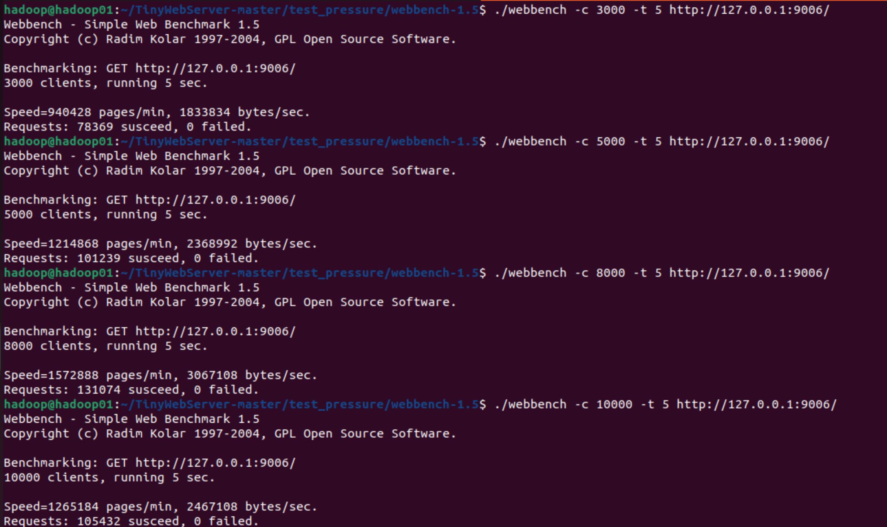

WebSeverV3
===============
相比V2的基础上，加入线程池，connfd改用ET，基本实现reactor，但http请求没变，仍然较为简单

-------------------------
使用webbench压测

* >并发量3000，时间5s-----15,673.8 QPS 
* >并发量5000，时间5s-----20,247.8 QPS
* >并发量8000，时间5s-----26,214.8 QPS
* >并发量10000，时间5s-----21,086.4 QPS

------------------------------
对比发现，升级后的版本QPS竟然不如V2

分析原因：
* >http请求过于简单，单条对于CPU时间可忽略不计，但是线程池增加了上锁->加入队列->解锁和上锁->取任务->解锁的流程，增加了资源消耗

* >存在严重的锁竞争。从数据可以看到，线程池版本在 8000 并发时达到巅峰，随后在 10000 并发时 QPS 骤降了约 5000。这是因为 10000 个请求同时涌入，主线程和 8 个工作线程都在疯狂抢夺同一个 m_queuelocker 互斥锁。CPU 的算力大量浪费在了“排队等锁”和“由于拿不到锁而挂起/唤醒”的过程中。
